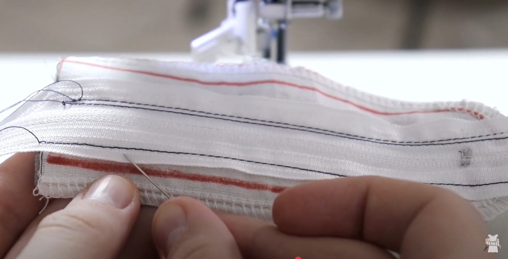

| Step                                                                                                                                                                       |                 Link or image                  |
| -------------------------------------------------------------------------------------------------------------------------------------------------------------------------- | :--------------------------------------------: |
| Start with the fly flaps already incorporated into the left and right front pieces                                                                                         |            |
| Interface the fly flaps                                                                                                                                                    |                |
| Finish the edge of the left (from the back) piece (the right will be finished later)                                                                                       |                     |
| Place pieces right sides together. Mark bottom of the fly and mark above about 3/8"                                                                                        |            |
| Sew with basting stitch to first marking                                                                                                                                   |                    |
| Start just a little below the end of the basting stitch. Backstitch and sew with normal stitch length all the way down.                                                    |              |
| Remember to press.                                                                                                                                                         |                      |
| Place zipper tape right side down on right of the pattern. Put the metal part of the tape around where the first marking is.                                               |          |
| Switch to zipper foot. Stitch down zipper tape.                                                                                                                            |    |
| Grab edge of free end of zipper tape (youtube link to timestamp: https://www.youtube.com/watch?v=gNbrGVJfHZY&list=PLu1cm76qZgNLV24GBwBkkviuIuoVWReB7&index=35&t=549s)      |           |
| Fold over and finger press                                                                                                                                                 |                  |
| Open up and flip to the back                                                                                                                                               |               |
| Grab left side of the sandwich and flip (youtube link to timestamp: https://www.youtube.com/watch?v=gNbrGVJfHZY&list=PLu1cm76qZgNLV24GBwBkkviuIuoVWReB7&index=35&t=549s)   |              |
| Stitch left side of zipper tape but this time not too close to the zipper                                                                                                  |  |
| Flip back to front. Add markings for the curve. Make sure the metal stopper is above the stitch line.                                                                      |                      |
| Start with backstitch and stitch the curve. Start from the bottom because it's easier (for me).                                                                            |               |
| Unpick the basting stitch from the top of the pants to the first mark that was made earlier.                                                                               |      |
| Attach fly guard to the right (from the back) fly. Not sure I like the way she did it in the video, try attaching it to the edge of the fly flap and finish them together. |                      TBD                       |
